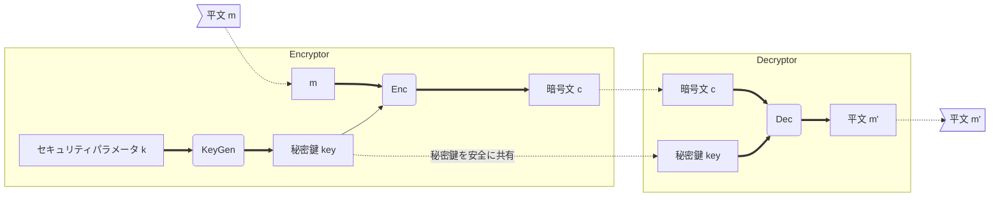

```mermaid
graph LR
    m0>平文 m]
    m3>平文 m']

    subgraph Encryptor
        k[セキュリティパラメータ k]
        KeyGen(KeyGen)
        key[秘密鍵 key]
        m[m]
        Enc(Enc)
        c[暗号文 c]
    end

    subgraph Decryptor
        c2[暗号文 c]
        key2[秘密鍵 key]
        Dec(Dec)
        m2[平文 m']
    end
    
    m0-.->m
    k==>KeyGen
    KeyGen==>key

    m==>Enc
    key-->Enc
    Enc==>c

    c-.->c2
    key-.->|秘密鍵を安全に共有|key2
    c2==>Dec
    key2==>Dec
    Dec==>m2

    m2-.->m3
```
